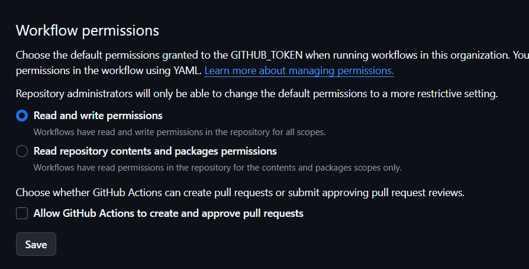
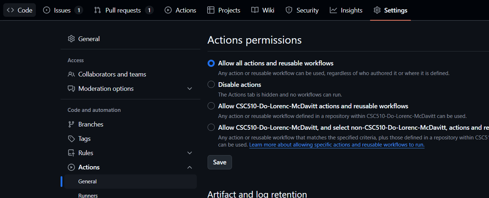

# Setting up the autodocs
Autodocs needs access to your repository to be able to update the documentation
### Organization permissions
If this repository is in your organization:
1. Go to your organization
2. Go to settings
3. Click on actions
4. Click general
5. In Workflow Permissions
  * Select Read and Write permissions
6. Click save

### Project permissions
1. Go to your repository
2. Go to settings
3. Go to actions and click general
4. In workflow permissions:
  * select read and write permissions
5. Click save

That's it! Your autodocumentation is now ready to go! It will autodoc everything in root layer of the backend folder.