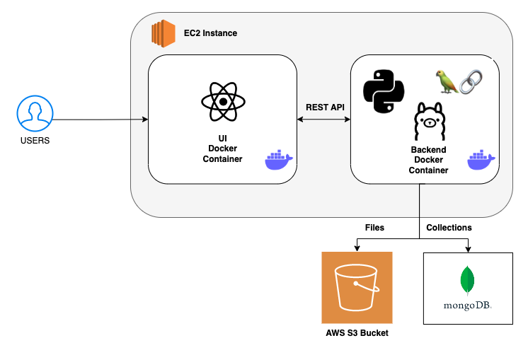

# JobTrackr Application

<p align="center">
  
</p>


[](https://github.com/CSC510-Do-Lorenc-McDavitt/jobtrackr/actions/workflows/frontend_build_test.yml)
[](https://github.com/CSC510-Do-Lorenc-McDavitt/jobtrackr/actions/workflows/backend_build.yml)
[](https://github.com/CSC510-Do-Lorenc-McDavitt/jobtrackr/actions/workflows/code_coverage.yml)


[](https://github.com/CSC510-Do-Lorenc-McDavitt/jobtrackr/releases/)
[](https://codecov.io/github/CSC510-Do-Lorenc-McDavitt/jobtrackr)

---

### Documentation for the project is available [here](https://CSC510-Do-Lorenc-McDavitt.github.io/jobtrackr/docs/backend/index.html).

---

## Table of Contents

- [Description](#description)
- [What's New?](#whats-new)
- [Development Tech Stack](#development-tech-stack)
- [Deployment Tech Stack](#deployment-tech-stack)
- [Architecture](#architecture)
- [CI/CD Pipeline](#cicd-pipeline)
- [Application Demo](#application-demo)
- [Getting Started](#getting-started---developer)
- [Development Specifications](#development-tech-stack)
  - [Backend](./backend/README-backend.md)
  - [Frontend](./ui/README-frontend.md)
- [License](./LICENSE)
- [Tools](#tools)
- [Contributors](#contributors)
- [Help](#help)

## Description

Are you someone in the process of looking for a job? Then you can relate to the tiresome and inefficient process. Therefore, excel sheets that are complex and disorganized must go! Every job-related data can be managed by our JobTrackr Application, including your job profile, applications, status, important dates, notes, saved applications, job descriptions, recruiter details, compensation and offer package, and more. It even supports even managing your files and offers a Question Answer Scratchpad for you to save answers to commonly asked questions during job applications. Now, we've pushed the limits to make your process even more convenient. Need to improve your resume? Do you need to create cover letters? Don't worry, we now support resume suggestions and cover letter creation with AI!

## What's New?
### Before
Save Applications
* Applications could be created and saved. These applications persist.

Track Applications
* Applications can be tracked by their status.

Manage Files
* Important files such as resumes or CVs could be uplodaed to AWS S3.

Question/Answer Scratchpad
* Common questions and answers can be stored for convenience.

Continuous Integration
* Deployment was done through GitHub Actions. With Jenkins, Ansible, and GitHub webhooks.

### After
Extra files not stored in backend
* Previously, when files from AWS S3 were sent to the user, they would be downloaded and kept in the backend directory as a side consequence. We have updated it so that the these files will not clog up our repository

Resume suggestions
* Users can now get resume suggestions! Have you ever wanted to get advice about your resume according to a job description but not know who to ask? Well, now you can ask AI to do it for you.

Cover letter generation
* Users can now generate cover letters for a specific job application with their resume! It makes it super convenient for jobs that keep asking for you to write 300+ words!

Cover Letters and Resume Suggestions can be downloaded
* Users can download the AI generated content as a .txt file to save!

Ollama integration
* We've integrated Llama3.2, a powerful AI system that gives seamless responses. Even better is that it is open source! You won't have to worry about cost!

UI update! Dropdown and company logos can now be added! 
> Are aesthetics important to you? Well do not fear, some new components are here!
* Dropdown
  * You can now move applications around with a dropdown instead of having to modify the application each time! Makes it way more convenient.
* Logos
  * You can now insert image links to display company logos on applications! This is for aesthetics! Now you can look at pictures instead of just looking only at text.

[](https://youtu.be/z4bh9J7PbMI)

## Development Tech Stack

<p align="center">

</p>

- `react 18.2.x`
- `babel 7.19.x`
- `webpack cli 4.x`
- `sass` (Dart Sass)
- `Python 3.8+`
- `Flask`
- `MongoDB`
- `Ollama`
- `LangChain`

Note: This repository is configured with [Dart-sass](https://github.com/sass/dart-sass) and not [Node Sass].

## Deployment Tech Stack

<p align="center">

</p>

- `AWS`
- `Docker`
- `Jenkins`
- `Ansible`

## Architecture

<p align="center">
  </a>
</p>

## CI/CD Pipeline

<p align="center">
  </a>
</p>

## Application Demo

[](https://youtu.be/pfs38jh5hPs)


## Getting Started - Developer

### Prerequisites

- npm 8.x (8.9 recommended)
- yarn 1.22.x
- Python 3.8+

### Installation

1. Clone the repository

```
git clone https://github.com/CSC510-Do-Lorenc-McDavitt/jobtrackr.git
```

2. [Backend Setup](./backend/README-backend.md)
3. [UI Setup](./ui/README-frontend.md)
4. [Workflow Setup](./.github/workflows)

## Tools

- Preetier Code Formatter
- PyLint with Flake8

## Third-Party Tools

- [MongoDB](https://www.mongodb.com/)
- [AWS](https://aws.amazon.com/)
- [Jenkins](https://www.jenkins.io/)
- [Ansible](https://www.ansible.com/)
- [ngrok](https://ngrok.com/)
- [Ollama](https://ollama.com/)
- [Llama3.2](https://ollama.com/library/llama3.2)

## Contributors

<table>
<tr>
    <td align="center"><a href="https://github.com/Kethly"><br /><sub><b>Thien Do</b></sub></a></td>
    <td align="center"><a href="https://github.com/Nlorenc2760"><br /><sub><b>Nathan Lorenc</b></sub></a></td>
    <td align="center"><a href="https://github.com/jfmcdavitt"><br /><sub><b>Jake McDavitt</b></sub></a></td>
</tr>
<tr>
    <td align="center"><a href="https://github.com/jayrajmulani"><br /><sub><b>Jayraj Mulani</b></sub></a></td>
    <td align="center"><a href="https://github.com/Yashasya"><br /><sub><b>Yashasya Shah</b></sub></a></td>
    <td align="center"><a href="https://github.com/Dhrumil0310"><br /><sub><b>Dhrumil Shah</b></sub></a></td>
    <td align="center"><a href="https://github.com/Harshil47"><br /><sub><b>Harshil Sanghavi</b></sub></a></td>
    <td align="center"><a href="https://github.com/anishasc99"><br /><sub><b>Anisha Chazhoor</b></sub></a></td>
</tr>
  <tr>
    <td align="center"><a href="https://github.com/rahulrk2303"><br /><sub><b>Rahul Rangarajan Kannan</b></sub></a></td>
    <td align="center"><a href="https://github.com/ekanshsinghal"><br /><sub><b>Ekansh Singhal</b></sub></a></td>
    <td align="center"><a href="https://github.com/gowtham-sathyan"><br /><sub><b>Gowtham Sathyan</b></sub></a></td>
    <td align="center"><a href="https://github.com/sbkrishna123"><br /><sub><b>Supriya Krishna</b></sub></a></td>
  </tr>
</table>

## License

Distributed under the MIT License. See `LICENSE` for more information.

## Help
Need help?

If you need any help with our software, please contact jobtrackr.github@gmail.com.
